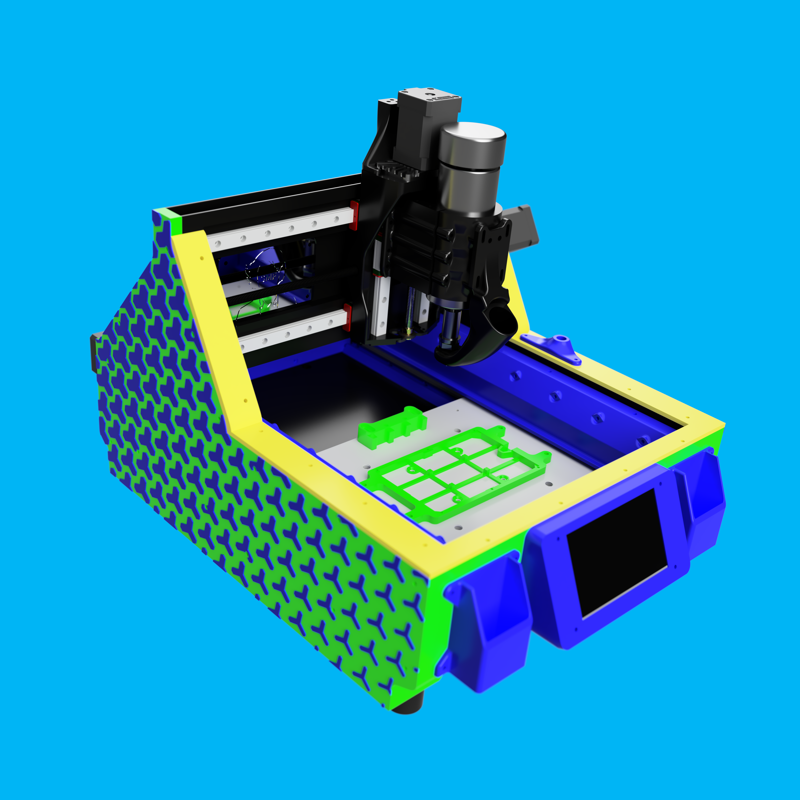
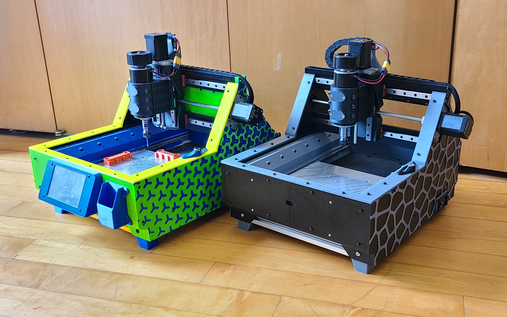

# Mostly Printed Mill - a mostly 3d printed, desktop sized mill/CNC

- *This project is unlikely to be maintained, it is being shared in case others find it interesting*
- *Functional as shared*
    - *aluminum (200mm/min, stepdown 10% endmill diameter, 12k rpm)*
    - *anything softer than aluminum (600mm/min, stepdown 10% endmill diameter, 12k rpm)*
    - *copper clad fr4, 1oz (600mm/min, 0.15mm total depth, 0.05mm passes, 30 degree endmill, 9k rpm)*
- *There are no fasteners in the .step files*
  

